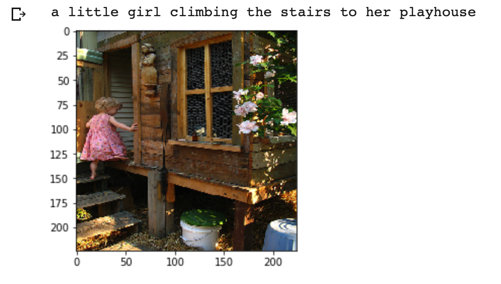
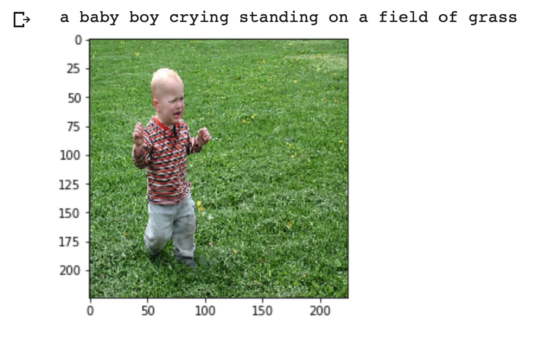

# Image Captioning

The repository contains the Deep Learning model to generate the description based from the feeded image. The project involves use of both Natural Language Processing and Computer Vision to create a model that can generate description based on the image as the input in the machine learning model.

I have used Flickr30k model to train the deep learning model. The model describes the image in the best possible way

### Predictions

## Frameworks
<ul>
<li> Keras
<li> Numpy
<li> Matplotlib
<li> pandas
</ul>

## Resources
<ul>
<li><a href = "https://fairyonice.github.io/Develop_an_image_captioning_deep_learning_model_using_Flickr_8K_data.html">Guide to image captioning</a>
<li><a href = "https://www.kaggle.com/hsankesara/flickr-image-dataset">Image captioning dataset</a>
</ul>

#### Made by Saransh Mittal
